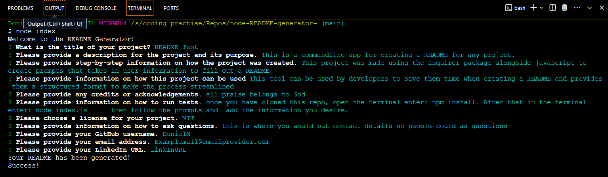
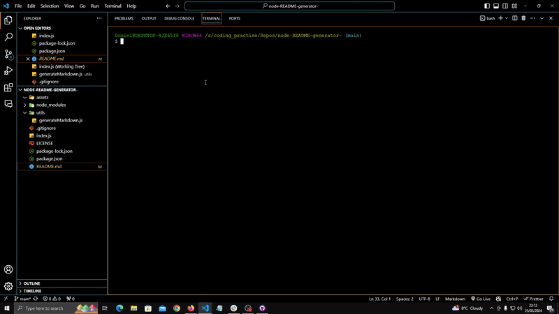

# node-README-generator-

## Description
 This README generator made using nodejs is a command-line application designed to help users quickly create high-quality README files for their new projects. This project was made using the inquirer package alongside javascript to create prompts that take in user information to fill out a  README.

## Installation
To install the README Generator, follow these steps:

Clone the repository to your local machine using 
```
git clone git@github.com:yourusername/node-README-generator-.git
```
Navigate into the project directory and run the below command to install the necessary dependencies.
```
npm install
```

## Usage
After installation, invoke the application with below command from the command line within the project directory. Answer the prompted questions about your project. Upon completion, a `README.md` file will be dynamically generated in your current directory, ready for use in your project.
```
node index.js
```
This will lead to a series of prompts that will allow you to generate a README file.

## Application screenshot



## App Gif


## Technologies Used
- [Node.js](https://nodejs.org/en/)
- [Inquirer Package](https://www.npmjs.com/package/inquirer)
- [License Badges](shields.io)

## License
Licensed under [MIT License](LICENSE.md).

## GitHub Repo
URL: https://github.com/DonielM/node-README-generator-
